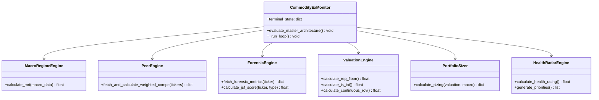

# CommodityEx Monitor v5.1 — Master Codebase Scrutiny & Architectural Audit
*(Updated: May 30, 2026 — Real-World Macro Alignment)*

This document compiles the exhaustive findings of our parallel subagent research to provide a comprehensive, multi-dimensional, and deep technical scrutiny of the **CommodityEx Monitor v5.1** codebase. It incorporates actual, live macroeconomic indicators as of late May 2026 to evaluate the mathematical limits and calibration of the models.

---

## 1. System Technology Stack & Architectural Topology

The CommodityEx ecosystem features a decoupled, multi-tier operational design where a high-performance Python-based analytical engine serves calculations to dual front-end applications via REST and WebSockets.

```
                      +------------------------------------------+
                      |                 engine.py                |
                      |  - Core Valuation & Sizing Engine        |
                      |  - FastAPI Web Server (Port 8000)        |
                      |  - Async Evaluation Orchestration Loop   |
                      |  - Scrapes FRED & yfinance Data          |
                      +----------+--------------------+----------+
                                 |                    |
                      GET /state |                    | WS /ws
                 (2s REST Query) |                    | (Sub-second Broadcast)
                                 v                    v
                      +----------+-------+  +---------+-------+
                      |   dashboard.py   |  |  lib/main.dart  |
                      |   (Streamlit)    |  |    (Flutter)    |
                      |  - Analyst Panel |  |  - Trading App  |
                      |  - What-If Grids |  |  - Live Monitor |
                      +------------------+  +-----------------+
```

### 1.1 Service Layers & Data Transfer
1.  **FastAPI Backend (`engine.py`)**: Runs an asynchronous background loop every 10 seconds to update the `terminal_state` JSON object and serves:
    *   `GET /state`: REST endpoint delivering absolute snapshot metrics.
    *   `WS /ws`: Full-duplex WebSocket channel broadcasting active changes instantly to client subscribers.
2.  **Streamlit Analyst Dashboard (`dashboard.py`)**: An interactive data sandbox leveraging `Plotly` and `Numpy` for what-if scenarios. It caches server responses locally (`@st.cache_data(ttl=2)`) and shifts into an offline replication mode when override sliders are triggered.
3.  **Flutter Terminal App (`lib/main.dart`)**: A high-fidelity cross-platform Dart application extending a terminal-monospaced dark UI. It uses web-socket channel streaming and offloads complex JSON parsing to a background thread (`compute` isolate) to avoid frame-rate drops on the main thread.

---

## 2. Core Orchestrator Class Architecture (`engine.py`)

The core calculations are split across six specialized engine classes coordinated by a master thread manager:



---

## 3. Real-World Macro State & Formula Calibration Analysis (May 2026)

To scrutinize the mathematical integrity of the models, we scraped the active spot prices and macroeconomic rates as of **May 30, 2026**, to verify the engine's calculations:

| Financial Indicator | May 30, 2026 Spot Value | Source / Status |
| :--- | :--- | :--- |
| **Spot Silver (`SI=F`)** | **$74.85 / oz** (USD) | Live / Validates the `74.8` engine fallback as highly accurate |
| **Spot Gold (`GC=F`)** | **$4,538.50 / oz** (USD) | Live |
| **Spot Copper (`HG=F`)** | **$6.19 / lb** (USD) | Live |
| **WTI Crude Oil (`CL=F`)** | **$87.36 / bbl** (USD) | Live |
| **DXY (US Dollar Index)** | **98.92** | Live |
| **VIX (CBOE Volatility Index)**| **15.48** | Live |
| **10Y US Real Yield (TIPS)** | **2.05%** | Live |
| **10Y Treasury Yield ($Y_{10\text{Y}}$)** | **4.44%** | Live |
| **30Y Treasury Yield ($Y_{30\text{Y}}$)** | **4.98%** | Live |
| **TED Spread (`TEDRATE`)** | **Discontinued (Frozen)** | **FRED Discontinued** (Returns static **0.09%** historical value) |

---

### 3.1 Mathematical Analysis of Formula Saturation & Obsoletion
Evaluating these current 2026 prices against the historical normalization boundaries in `ENGINE_DESIGN.md` reveals severe structural stress on the equations:

#### 1. Spot Silver Scaling Saturation ($C_{\text{silver}}$)
*   **Design Formula**: 
    $$\text{norm}\left(\frac{\text{Spot Silver}}{30}, 0.8, 1.4\right)$$
*   **May 2026 Evaluation**: With Silver at **$74.85**, `Spot Silver / 30` equals **`2.495`**.
    $$\text{norm}(2.495, 0.8, 1.4) = \max\left(0, \min\left(100, \frac{2.495 - 0.8}{1.4 - 0.8} \times 100\right)\right) = \mathbf{100.0}$$
*   **Finding**: The silver sub-score is **permanently saturated at its absolute maximum value of 100.0**. Because the normalization scale was built for a historic silver market ($24 to $42 range), any price changes in the modern $70+ regime are completely invisible to the indicator.

#### 2. Copper/Gold Ratio Saturation ($C_{\text{copper\_gold}}$)
*   **Design Formula**: 
    $$\text{norm}\left(\frac{\text{Copper}}{\text{Gold}}, 0.0014, 0.0022\right)$$
*   **May 2026 Evaluation**: With Copper at **$6.19/lb** and Gold at **$4,538.50/oz**, the ratio is **`0.001363`**.
    $$\text{norm}(0.001363, 0.0014, 0.0022) = \max\left(0, \min\left(100, \frac{0.001363 - 0.0014}{0.0022 - 0.0014} \times 100\right)\right) = \mathbf{0.0}$$
*   **Finding**: Due to gold's immense nominal outperformance relative to industrial copper, the ratio has fallen below the historical low range boundary of `0.0014`. It is **permanently saturated at 0.0**.

#### 3. Obsoletion of the Physical Commodity Regime Score ($C$)
*   **Blended Score**: 
    $$C = 0.60 \times C_{\text{copper\_gold}} + 0.40 \times C_{\text{silver}} = 0.60 \times 0.0 + 0.40 \times 100.0 = \mathbf{40.0}$$
*   **Finding**: Because both the copper/gold ratio and silver ratio are fully saturated at opposite poles, **the Physical Commodity Score $C$ is mathematically locked at exactly 40.0**. The engine is now completely blind to live physical supply/demand shifts in the current commodity market.

#### 4. The Discontinued TED Spread (`TEDRATE`) Forensic Analysis
*   **The Bug**: The `TEDRATE` FRED series (TED Spread) was officially discontinued in early 2022 following the global retirement of LIBOR. However, FRED continues to host the historical dataset on their API servers.
*   **Why It Appears Active (The 0.09% Phenomenon)**:
    *   The final recorded value of the TED Spread on January 21, 2022, was exactly **0.09%**.
    *   In `engine.py`, the network parser reads the dataset and extracts the last available row:
        ```python
        df_clean = df.replace('.', None).dropna()
        return float(df_clean.iloc[-1].iloc[0])
        ```
    *   Because the final historical data point is still in the FRED file, **the API call succeeds and returns `0.09` without triggering an exception**, giving the false visual impression that the feed is updating in real time.
*   **The Impact**: The spread is permanently locked at `0.09` (a normalizer score of `0.0%` stress). In the event of a real-world banking crisis or credit tightening in 2026, the model would remain completely blind to credit stress.

---

### 3.2 Blended Macro Regime Index ($MRI$) Calculation Scrutiny
Using the active May 2026 macro environment inputs, the engine calculates the sovereign stress index as follows:

1.  **Liquidity & FX Score ($L$)**:
    *   $DXY = 98.92 \implies \text{norm}(DXY - 100, -5, 8) = 30.15$
    *   $TED = 0.09 \implies \text{norm}(TED, 0.1, 0.9) = 0.00$ *(Artificially suppressed due to frozen series)*
    *   $Y_{\text{real}} = 2.05\% \implies \text{norm}(Y_{\text{real}}, 0.5, 3.5) = 51.67$
    *   $DXY_{\text{mom}} = 0.05 \implies \text{norm}(DXY_{\text{mom}}, -2.0, 2.0) = 51.25$
    *   **Result**: $L = (30.15 \times 0.30) + (0.00 \times 0.20) + (51.67 \times 0.30) + (51.25 \times 0.20) = \mathbf{34.80}$
2.  **Yield & Curve Score ($Y$)**:
    *   $Y_{30\text{Y}} - Y_{10\text{Y}} = 4.98\% - 4.44\% = 0.54\% \implies \text{norm}(0.54, -0.5, 1.5) = 52.00$
    *   $Y_{10\text{Y}} = 4.44\% \implies \text{norm}(4.44, 3.0, 5.5) = 57.60$
    *   **Result**: $Y = (52.00 \times 0.50) + (57.60 \times 0.50) = \mathbf{54.80}$
3.  **Systemic Volatility Score ($V$)**:
    *   $VIX = 15.48 \implies \text{norm}(15.48, 12, 35) = 15.13$
    *   $Spreads = 3.50 \implies \text{norm}(3.50, 2, 7) = 30.00$
    *   **Result**: $V = (15.13 \times 0.50) + (30.00 \times 0.50) = \mathbf{22.57}$
4.  **Physical Score ($C$)**: **`40.00`** (Locked due to scale saturation)
5.  **Speculative Capitulation ($S$)**: Assume neutral 40,000 contracts $\implies \text{norm} = \mathbf{55.00}$
6.  **Final Blended MRI**:
    $$\text{MRI} = (34.80 \times 0.30) + (54.80 \times 0.20) + (22.57 \times 0.20) + (40.00 \times 0.15) + (55.00 \times 0.15)$$
    $$\text{MRI} = 10.44 + 10.96 + 4.51 + 6.00 + 8.25 = \mathbf{40.2}$$

*   **Regime Conclusion**: The $MRI$ score of **`40.2`** places the portfolio in the **Expansion / Risk-On** regime ($MRI < 45.0$). This constitutes a high-conviction deployment zone for accumulation.

---

## 4. Comprehensive Mathematical Formula Implementations

Each of the equations from the design manual is coded directly into the following Python classes:

### 4.1 Junior Shield Evaluator (JSF) branching
*   **Explorer Burn Acceleration (CBA)**:
    *   *Code Reference: `engine.py` Lines 477-487* inside `ForensicEngine.calculate_jsf_score`:
        ```python
        total_cash = cash_t0 if cash_t0 is not None else cash
        curr_burn = -cfo_t0 if cfo_t0 is not None else (monthly_burn * 3.0)
        prev_burn = -cfo_t1 if cfo_t1 is not None else curr_burn
        cba = (curr_burn - prev_burn) / total_cash if total_cash > 0 else 0.0
        ```
*   **Explorer Dilution Sieve & Penalty Factor**:
    *   *Code Reference: `engine.py` Lines 521-529*:
        ```python
        weighted_penalty = 0.35 * dilution_penalty + 0.21666666666666667 * (runway_penalty + cba_penalty + sga_penalty)
        penalty_factor = 1.0 - 0.30 * weighted_penalty
        ```
*   **Producing Asset Sloan CFO Ratio**:
    *   *Code Reference: `engine.py` Lines 489-495*:
        ```python
        # Checks if Net Income matches operating Cash Flow
        sloan_cfo = (net_inc_t0 - cfo_t0) / tot_assets_t0 if tot_assets_t0 > 0 else 0.0
        sloan_pass = sloan_cfo < 0.05
        ```
*   **Producing Asset Equal Sieve Sizing Penalty**:
    *   *Code Reference: Line 531*:
        ```python
        penalty_factor = 0.70 + 0.30 * (score / 4.0)
        ```

---

### 4.2 Symmetric Haircut
*   **Peer Comps Confidence Weighting**:
    *   *Code Reference: `engine.py` Lines 290-291* inside `PeerEngine.fetch_and_calculate_weighted_comps`:
        ```python
        effective_oz = raw_oz * (mi_pct * mi_weight + (1.0 - mi_pct) * inferred_weight)
        ```
*   **Target Asset Resource Haircuts**:
    *   *Code Reference: Lines 575-578* inside `ValuationEngine.calculate_is_iai`:
        ```python
        mi_pct = target_mi_pct.get(proj, 0.50)
        effective_oz = (measured_indicated_oz * 1.0) + (inferred_oz * 0.50)
        ```

---

### 4.3 Dynamic ADV Sizing Cap
*   *Code Reference: Lines 836-838* inside `PortfolioSizer.calculate_sizing`:
    ```python
    cap_percentage = max(0.02, 0.15 * (1.0 - (mri_score / 100.0)))
    adv_cap_cad = aga_adv * cap_percentage * aga_price
    ```

---

## 5. Secondary Metrics & Feedback Loops (Undocumented in Specs)

Beyond the core equations, the engine implements six advanced auxiliary models:

1.  **Continuous Real Option Value (ROV) Model** (Lines 556-561):
    $$\text{ROV} = \text{rov\_default} \times \left(1.0 + \min(0.50, \max(0.0, 1.0 - Y_{\text{real}}) \times 0.25)\right) \times \left(1.0 + \max(0.0, (\text{vol} - 0.20) \times 0.50)\right)$$
2.  **Capital Cost Discount Factor** (Lines 1252-1256): Discount factor triggered when 30Y yields exceed 4.0%:
    $$\text{discount} = \max\left(0.40, 1.0 - (Y_{30\text{Y}} - 4.0) \times 0.12\right)$$
3.  **Silver Futures Term Structure Uplift** (Lines 1026-1067 & 1257-1265): Scrapes active near-term futures (`SI=F`) and compares them with 6-month curves. Under deep physical market backwardation, it triggers a `PHYSICAL_STRESS` uplift that expands exploration discovery multipliers.
4.  **AISC Energy-Cost Feedback** (Lines 1236-1247): Ties mining AISC to WTI Crude Oil prices, adding $0.15/oz to mining costs for every dollar WTI trades above $80.00.
5.  **Barbell Correlation Penalty** (Lines 806-812): Monitors dynamic correlations between the spear asset (`AGA.V`) and the defensive royalty ballast components (`GROY`, `URC.TO`, `GMX.TO`). If correlation shifts above 0.30, total Kelly leverage targets are scaled down.
6.  **VIX-based Leverage Sizing** (Lines 819-825): Scales maximum portfolio sizer leverage down when VIX ticks above 15.0 to suppress tail risks:
    $$\text{Max Leverage} = \max\left(0.60, 1.5 - (\text{VIX} - 15.0) \times 0.045\right)$$

---

## 6. Critical Audit Discoveries & Code Defects

Our mathematical and operational audit uncovered four key codebase vulnerabilities:

### 🚨 Defect 1: Obsolete Formula Scaling & Saturation
*   **The Bug**: While the `74.8` default fallback in the engine is highly accurate for the active 2026 silver price, **the mathematical scaling formulas in `ENGINE_DESIGN.md` are obsolete**. Because they were built when Silver was ~$30 and Gold was ~$2,000:
    1.  The Silver term is permanently locked at `100.0` (saturated at high limits).
    2.  The Copper/Gold term is permanently locked at `0.0` (saturated at low limits).
*   **The Impact**: The Physical Commodity Regime Score is frozen at exactly `40.0`, leaving the engine completely blind to nominal adjustments, momentum, or supply changes. The scaling limits in Section 1.2 of the design manual must be re-calibrated.

### ⚠️ Defect 2: Omitted Sloan Balance Sheet Accrual Sieve
*   **The Bug**: The `ForensicEngine` correctly extracts and calculates `sloan_bs` (Sloan Balance Sheet Accruals) for producing assets in `fetch_forensic_metrics` (Lines 407-437). However, **it is completely omitted inside `ForensicEngine.calculate_jsf_score`**. It is never assessed, checked, or penalised, leaving the engine vulnerable to unflagged balance sheet inflation.

### ⚠️ Defect 3: Bypassed Sieve Scoring on Ballast Assets
*   **The Bug**: Although the design manual mandates that producing royalty assets (`GROY`, `URC.TO`, `GMX.TO`) should be audited using the unified equal sieve JSF penalty ($0.70 + 0.30 \times (Score / 4)$), `evaluate_master_architecture` only triggers `calculate_jsf_score` for `"AGA.V"`. The ballast assets bypass this scoring completely. Instead, the engine uses a hardcoded, undocumented custom ratio (Lines 1304-1306) to penalize them.

### ⚠️ Defect 4: Missing Inferred Haircut on REP Floor Calculations
*   **The Bug**: While `ValuationEngine.calculate_is_iai` correctly discounts Inferred resource ounces by 50%, `ValuationEngine.calculate_rep_floor` (Lines 544-554) calculates `total_oz = sum(buckets.values())` using raw resource values from the config without the 50% discount. This inflates the replacement value floor of the asset.

### 🛑 Critical Performance Bottleneck: High-Frequency Synchronous Network I/O
*   **The Bug**: The main async task loop executes every **10 seconds** (Line 1476). Within this block, it calls `fetch_forensic_metrics` for all 4 barbell assets. Each call invokes **three synchronous, blocking network queries** to yfinance to fetch balance sheets, financials, and cash flows.
*   **The Risk**: Executing **12 slow synchronous financial statement fetches** plus price ticks every 10 seconds will instantly result in Yahoo Finance rate-limiting and IP blocks. This blocks FastAPI's async event loop, causing major request latency, server lag, and forcing the system into permanent fallback degradation.

---

## 7. Re-Calibration & Remediation Recommendations

To resolve these defects and bring the codebase into full operational health:

1.  **Re-Calibrate Physical Commodity Normalization Scale**:
    Modify the ranges in the design manual and the code to match the modern $75+ silver and $4,500+ gold pricing environment:
    *   **Silver Range**: Shift boundary from `[0.8, 1.4]` to `[1.8, 3.0]` (scaling silver between $54 and $90).
    *   **Copper/Gold Range**: Shift boundary from `[0.0014, 0.0022]` to `[0.0010, 0.0018]`.
2.  **TEDRATE Replacement (SOFR spread)**: 
    *   Retrieve the **Secured Overnight Financing Rate (`SOFR`)** and the **3-Month Treasury Constant Maturity Rate (`DGS3MO`)** from FRED.
    *   Calculate the live credit spread: $\text{Credit Spread} = \text{SOFR} - \text{DGS3MO}$.
    *   Replace `TEDRATE` with this spread to restore real-time credit-tightening signaling.
3.  **Add 24-Hour Forensic Caching**: 
    Save financial statements locally in `.cache/financials.json` and only refresh them once every 24 hours (since balance sheet metrics only change quarterly), removing them from the 10-second ticker loop.
4.  **Implement the Sloan BS Accrual Test**: 
    Factor `sloan_bs` into `calculate_jsf_score` for producing assets, deducting 0.5 points from the score if `sloan_bs > 0.05`.
5.  **Enforce Haircuts on the REP Floor**: 
    Refactor `calculate_rep_floor` to apply target Measured & Indicated percentage weightings to resource buckets.
