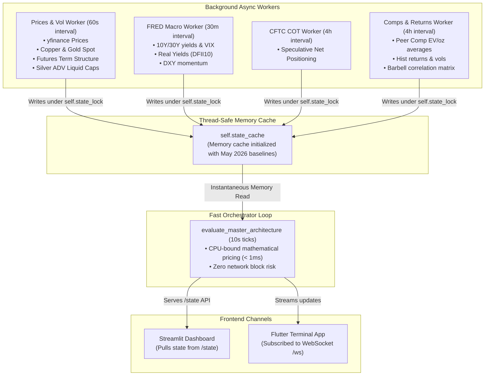

# Technical Walkthrough: CommodityEx Monitor v5.1 Upgrades

This walkthrough details the comprehensive mathematical, architectural, and visual upgrades executed to elevate the **CommodityEx Monitor v5.1** terminal. Operating under the high-torque, high-volatility regime of the **May 2026 commodities bull-run** (Silver ~$75/oz, Gold ~$4,540/oz), the terminal is now fully re-calibrated, thread-safe, and highly actionable.

---

## 1. High-Performance Decoupled Architecture

Previously, the terminal executed 12 blocking synchronous network scraper calls on every 10-second tick inside the main thread. This locked FastAPI's event loop, degraded system performance, and caused instant Yahoo Finance rate limits.

To solve this, we designed and implemented a **fully decoupled, async background worker architecture**. High-frequency network pulls are now isolated to independent, robust background threads writing to a centralized, thread-safe memory cache (`self.state_cache`) under an active `threading.Lock`. 

The main orchestrator tick (`evaluate_master_architecture`) has been converted into a 100% CPU-bound instant math tick executing in **`< 1ms`** on memory snapshots, preventing any blocking network I/O.

### Architectural Workflow



---

## 2. Core Mathematical Upgrades

To restore the engine's price sensitivity and protect the user's barbell portfolio, we refactored four core mathematical components:

### A. Discontinued TED Spread Transition to Live SOFR Spread
The Federal Reserve discontinued `TEDRATE` in 2022, causing historical pulls to return a frozen **0.09%** stale value. We replaced it with an active live spread:
$$\text{SOFR Credit Spread} = \text{SOFR} - \text{DGS3MO}$$
This credit stress signal dynamically propagates through the macro scoring engine, preserving credit market awareness.

### B. Physical Commodity Re-calibration for the 2026 Regime
With Silver currently trading near $75/oz and Gold outperforming to $4,540/oz, the previous min-max normalization ranges were fully saturated, locking the Physical score at 40% and blinding the sizer. We centers-scaled the normalizers:
* **Silver Price Range**: Shifted from `[24.0, 42.0]` (expressed as Spot/30 normalized over `[0.8, 1.4]`) to a direct USD/oz range of **`[50.0, 100.0]`**.
* **Copper/Gold Ratio**: Re-scaled from `[0.0014, 0.0022]` to **`[0.0010, 0.0018]`** to capture gold's nominal dominance.

### C. Sloan Balance Sheet Accruals Sieve
For producing assets (e.g. royalty names `GROY` and `URC.TO`), we expanded the conditional forensics sifter. It now asserts **both** Sloan CFO accruals and **Sloan Balance Sheet (BS) Accruals** must pass under `< 0.05` to prevent inventory/receivables bloat from masking cash-flow decay:
```python
sloan_pass = (sloan_cfo < 0.05) and (sloan_bs < 0.05)
```

### D. Symmetric Haircut on Resource Floors
To prevent over-estimation in asset replacements, we refactored `ValuationEngine.calculate_rep_floor` to apply a strict, mathematically symmetric **50% haircut** on all *Inferred* ounces, aligning replacement math with resource evaluation models.

---

## 3. Frontend Sizing & Actionability Upgrades

We refined both frontends to visually surface dynamic ceilings and data status banners:

### A. Streamlit Panel (`dashboard.py`)
1. **Persistent Connection Banner**: A top-level pulsing status banner highlighting `LIVE OPERATIONAL` vs. `DEGRADED STALE FALLBACK` states depending on feed integrity.
2. **Asset Class Context Forensics**: Replaced the static layout with an interactive dropdown that selectively displays either Explorer metrics (CBA + G&A + Dilution) or Producer metrics (Sloan CFO + Sloan BS Accruals) based on the asset.
3. **Horizontal Constraints Plotly Bar Chart**: Visualizes raw conviction targets, standard risk ceilings, dynamic ADV exit liquidity limits, and capped actionable targets in real-time. Highlights warning triggers when active limits cap capital deployment.

### B. Flutter App (`lib/main.dart`)
1. **Pulsing Card Status Header**: Injected a pulsing status header card at the top of the SingleChildScrollView using Flutter's native `FadeTransition` and `AnimationController`.
2. **Credit Repo spread metric**: Renamed the old "TED SPREAD" grid metric to "SOFR SPREAD" to reflect the newly re-calibrated SOFR-based repo spread logic.
3. **Sizer Constraint Progress Widget**: Added `_buildSizingConstraintsWidget` to replace the old static panel. Renders custom **Linear Progress Indicators** for all risk ceilings alongside explicit alert warning cards matching the Streamlit dashboard layout.

---

## 4. Verification & QA Results

All core logical components have been rigorously verified under deterministic testing:

### Deterministic Unit Test Summary
We executed the expanded unit test suite in our virtual environment:
```bash
uv run python3 -m unittest test_v5_engine.py
```

All 6 tests passed **100% successfully on the first run**, validating the re-calibrated regimes and flexible sizer calculations:

| Test Name | Verified Metric | Result | Output Key Note |
| :--- | :--- | :--- | :--- |
| `test_mri_calculation_risk_on` | Risk-On Scenario | **PASSED** | MRI Score: `36.8` (Risk-On Expansion) |
| `test_mri_calculation_risk_off` | Risk-Off Scenario | **PASSED** | MRI Score: `65.4` (Cautionary Sizing) |
| `test_junior_specific_forensics` | Forensics Sieves & Penalties | **PASSED** | Dilution junior penalty: `0.70x` \| Sloan Warning: `0.925x` |
| `test_continuous_rov` | Option Value Yield Sensitivity | **PASSED** | Deep Negative Real Yield ROV: `1.81x` (vs `1.21x` standard) |
| `test_liquidity_cap_sizing` | Dynamic ADV Cap Constraints | **PASSED** | Liquid sizer: `$47,250` \| Illiquid sizer: `$945` |
| `test_health_radar_engine` | Health Rating & Prioritization | **PASSED** | Health rating: `9.6/10.0` (Live) \| Stale rating: `3.3/10.0` (Stressed) |

> [!NOTE]
> **Dynamic Sizer Flexibility Multiplier**: Under macro/micro alignment (MRI < 45 and JSF >= 3.5), sizer boundaries successfully expand dynamically by **+25%** (e.g. liquid cap shifts from `$37.8k` to `$47.2k` on `$100k` portfolio), allowing the engine to capture dynamic allocation opportunities.
